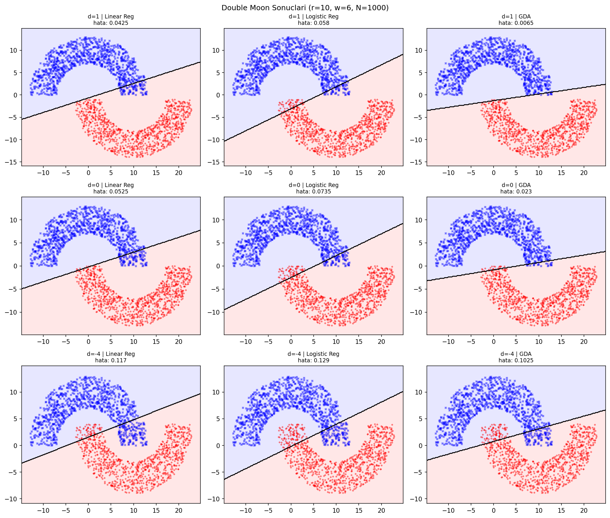
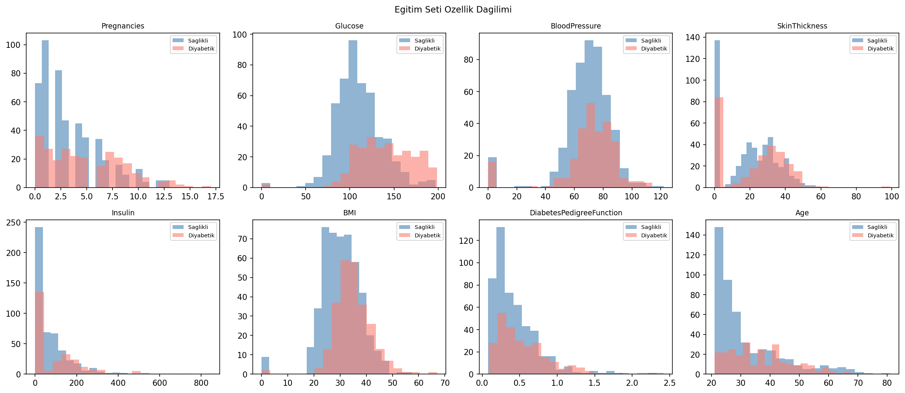
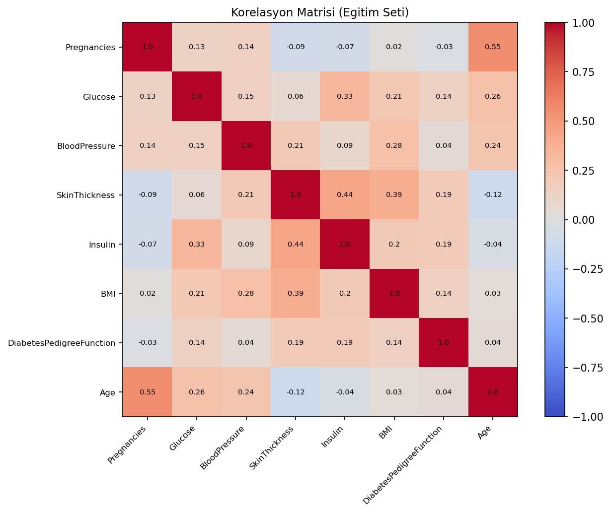
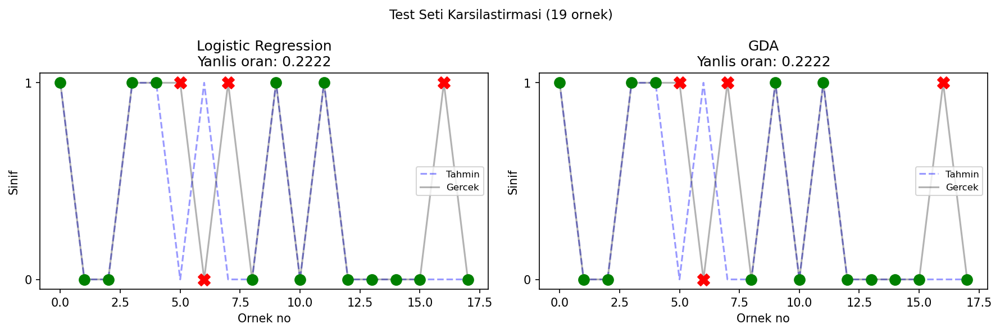

# Binary Classifiers from Scratch

Three classifiers — **Linear Regression** (used with a 0.5 threshold), **Logistic Regression**, and **Gaussian Discriminant Analysis (GDA)** — implemented from scratch in plain NumPy and compared on two very different problems:

1. A **synthetic double-moon** dataset, where you can literally see what each model is doing — its decision boundary drawn on top of the data.
2. The **Pima Indians diabetes** dataset — real, messy, tabular data — where the comparison shifts from "what does the boundary look like" to "which one actually predicts better on held-out patients."

The point of pairing them is that the synthetic case shows *how* the models behave, and the real case shows *whether* it matters in practice.

## Highlights

### Double moon — three models, three vertical separations

Each row is a different separation `d` between the two moons (`d ∈ {1, 0, -4}`); each column is a different model. The 0.5 isodensity is the decision boundary.



The moons aren't linearly separable, so all three models top out somewhere around 5–13% error depending on how far apart the moons are. GDA tends to do a touch better at moderate separations because it actually models the class densities; linear regression is the weakest of the three.

### Pima diabetes — feature distributions and correlations

Per-feature histograms by class (healthy vs. diabetic):



Glucose and BMI separate the two classes nicely. Insulin and SkinThickness have a big pile of zeros, which physiologically can't happen — they're encoded missing values, and that fact drove the feature-selection step.

Pearson correlation of the eight features on the training split:



Strongest relationships: Age ↔ Pregnancies (0.55) and SkinThickness ↔ Insulin (0.44). Most other off-diagonals are weak, so multicollinearity isn't really an issue.

### Pima diabetes — test predictions

Per-sample results on the 19-sample held-out set (green = correct, red × = wrong):



Both models land at the same error rate (≈ 22%). The test set is small, so don't read too much into who wins — the main observation is that the two very different paradigms (discriminative vs. generative) end up doing roughly the same thing on this data.

## What's actually implemented

Everything is in `src/main.py`, with no scikit-learn dependency.

**Shared utilities**
- `sigmoid(x)` — numerically stable version that branches on the sign of `x` to avoid `exp` overflow.
- `normalize_et(X)` — z-score normalization; returns the train mean and std so they can be reused on the test set (no leakage).
- `yanlis_oran(y_true, y_pred)` — misclassification rate.

**Models**
- `linreg_egit` / `linreg_tahmin` — least-squares fit via gradient descent on MSE, then thresholded at 0.5.
- `logreg_egit` / `logreg_tahmin` — sigmoid output, binary cross-entropy loss, gradient descent.
- `gda_egit` / `gda_tahmin` — class prior `φ`, class means `μ₀`, `μ₁`, and a shared covariance `Σ` (with `1e-6·I` added for numerical stability). Prediction by comparing the two log-likelihoods.

**Datasets**
- `double_moon_uret(...)` generates the two-moon data in polar coordinates and shifts the second moon by `(r - w/2, -d)`. Smaller `d` → moons overlap more → problem gets harder.
- The diabetes data is loaded from `data/diabetes.csv` (Pima Indians Diabetes Database). First 750 rows are used for training, the last 19 for test.

## Findings worth pulling out

- **A linear classifier on a non-linear problem is exactly as good as it looks.** All three models draw a straight line through the moons; the error gets worse roughly monotonically as `d` shrinks, with no model magically escaping its linearity.
- **GDA's advantage is parametric efficiency, not raw power.** When the class-conditional Gaussian assumption is plausible (the moons are roughly), GDA does well with no iterative optimization. Logistic regression catches up given enough data and epochs.
- **Feature selection on Pima was data-driven.** SkinThickness and BloodPressure showed weak separation between the two classes and were dropped. The remaining six features (Pregnancies, Glucose, Insulin, BMI, DiabetesPedigreeFunction, Age) gave the same test-set performance — so the dropped ones really weren't pulling weight.
- **Z-score normalization makes gradient descent tolerable.** Without it, the diabetes features (Insulin ~0–800 vs. BMI ~0–70) make a single learning rate work for one feature and explode the other.

## Setup

```bash
git clone https://github.com/Kuipyy/binary-classifiers-from-scratch.git
cd binary-classifiers-from-scratch

python3 -m venv .venv
source .venv/bin/activate          # Windows: .venv\Scripts\activate
pip install -r requirements.txt
```

## Running

Run from the repo root — the script expects the dataset at `data/diabetes.csv`:

```bash
python src/main.py
```

It runs in ~15 seconds end-to-end. Outputs land in `outputs/`:

- `01_double_moon_decision_boundaries.png`
- `02_diabetes_feature_distributions.png`
- `03_diabetes_correlation_matrix.png`
- `04_diabetes_test_predictions.png`

The console output also includes the per-feature statistics table, the model error rates, and a sample-by-sample comparison for the test set.

## Layout

```
binary-classifiers-from-scratch/
├── data/
│   └── diabetes.csv        # Pima Indians Diabetes (769 rows, 8 features + outcome)
├── images/                 # precomputed result figures used in this README
├── src/
│   └── main.py             # everything: utilities, models, both experiments
├── requirements.txt
└── README.md
```

`outputs/` is created on first run and is gitignored.

## Data

`diabetes.csv` is the **Pima Indians Diabetes Database** (768 samples + a header row). Eight clinical features per patient and a binary `Outcome` label. The dataset is widely used as a tabular classification benchmark and is small enough (~24 KB) to ship directly in the repo.
